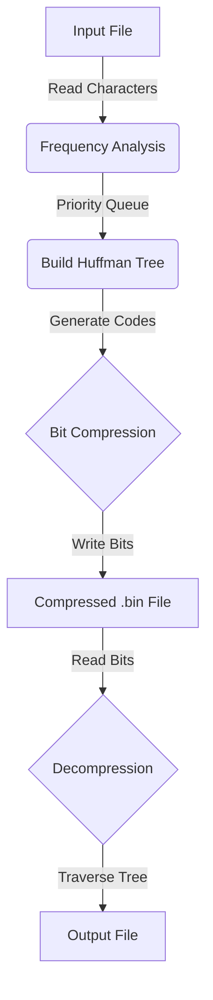

# File Compressor (Huffman Coding)


A C++ tool that compresses and decompresses text files using the **Huffman Coding** algorithm.  
I built this project to understand how file compression works at a low level, with a focus on **bit manipulation** and **data structures**.

---

## 🚀 Key Features

- **Compress Files:** Reads a text file and converts it into a smaller binary `.bin` file  
- **Decompress Files:** Restores the original text from the binary file with 100% accuracy  
- **Efficiency:** Uses a **Min-Heap** and **Huffman Tree** to assign shorter codes to frequent characters  
- **Bit Manipulation:** Custom buffer packs variable-length codes into 8-bit bytes  

---

## 🛠️ How It Works

1. **Frequency Analysis**  
   Counts how many times each character appears in the input file

2. **Building the Tree**  
   Uses a priority queue to build a Huffman Tree where frequent characters have shorter paths

3. **Encoding**  
   Generates a unique binary code (e.g. `0`, `1101`) for each character

4. **Writing Bits**  
   Packs bits into bytes using a custom buffer before writing to disk

---

## 🧩 System Architecture



---

## 💻 How to Run

### Compile
```bash
g++ main.cpp huffman.cpp -o huffman
```

### Run
```bash
./huffman
```

### Flow
- Enter the filename (e.g., `input.txt`)
- Program generates `compressed.bin`
- Automatically decompresses to `output.txt` for verification

---

## 📊 Performance Analysis

| File Type | Original Size | Compressed Size | Reduction |
|----------|--------------|-----------------|-----------|
| Text File (Essay) | 12 KB | 7.8 KB | ~35% |
| Code File (.cpp) | 4 KB | 2.9 KB | ~27% |
| Repeated Characters | 1 KB | 0.05 KB | ~95% |

**Note:** Compression efficiency depends on character frequency distribution.  
Files with high redundancy achieve better compression.

---

## 🧪 Testing Strategy

Since this is a **lossless compression** tool, correctness was validated using:

- **Empty File Test**  
  Ensured program handles 0-byte files safely

- **Single Character Test**  
  Tested files like `"aaaaaa"` to validate edge cases

- **Round-Trip Verification**
```bash
./huffman
diff input.txt output.txt
```
Ensures decompressed output matches original input exactly.

---

## 📚 Tech Stack

- **Language:** C++  
- **Concepts Used:**
  - Greedy Algorithms
  - File I/O (`fstream`)
  - Pointers & Memory Management
  - STL (`map`, `vector`, `priority_queue`)

---

## 📂 Project Structure

```
📦 Huffman-File-Compressor
 ┣ 📜 huffman.h        # Interface (Header file)
 ┣ 📜 huffman.cpp      # Core compression logic
 ┣ 📜 main.cpp         # CLI entry point
 ┣ 📜 input.txt        # Sample input
 ┗ 📜 README.md        # Documentation
```

---

## ⚠️ Limitations & Future Improvements

- **Metadata Overhead:**  
  Huffman Tree is rebuilt during decompression. A production version would serialize the tree into the file header.

- **Memory Usage:**  
  Entire file is loaded into memory. Large files would require streaming (chunk-based I/O).

- **Padding Bits:**  
  Extra bits may appear due to byte alignment. Storing total character count would fix this.

---

## 🧠 Key Learnings

- **Bitwise Operations:**  
  Practical use of `<<`, `>>`, and `|` for data packing

- **Memory Management:**  
  Managed dynamic memory for tree nodes safely

- **System Design:**  
  Refactored monolithic code into clean, modular components

---

## 🤝 Contributing

Contributions are welcome!  
Feel free to open an issue or submit a Pull Request.

---

## 📜 License

This project is open-source and available under the **MIT License**.
